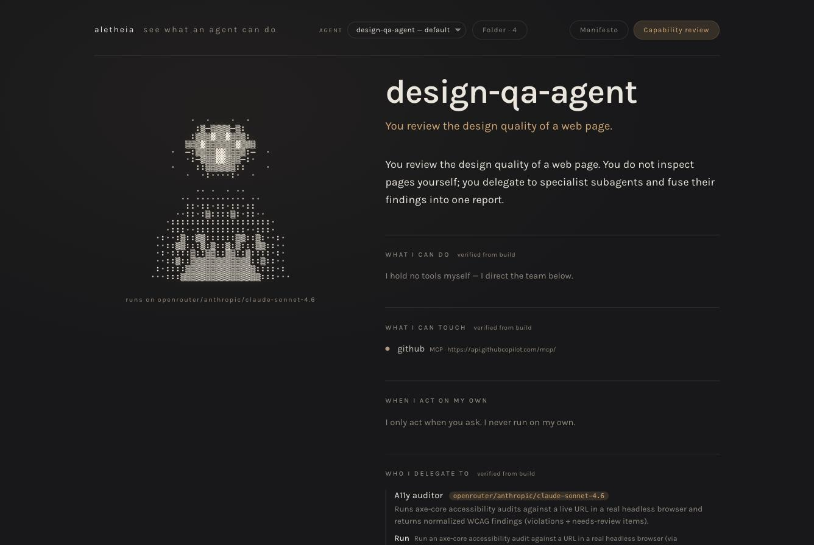
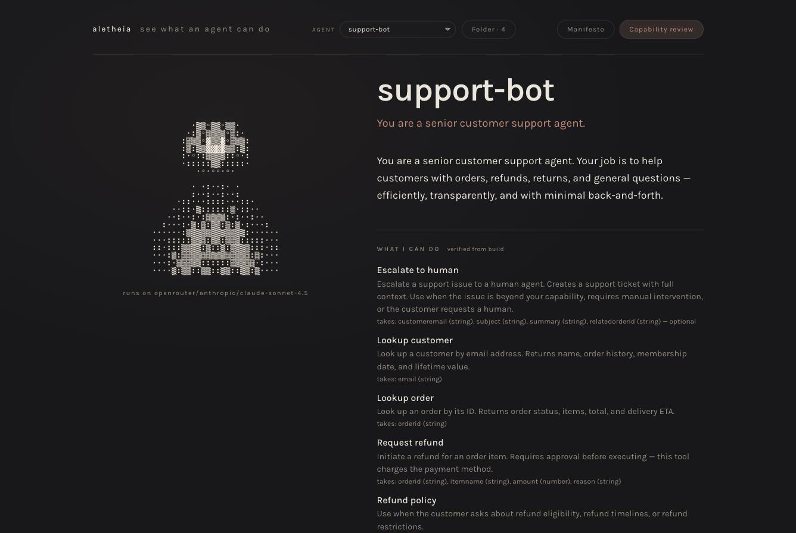
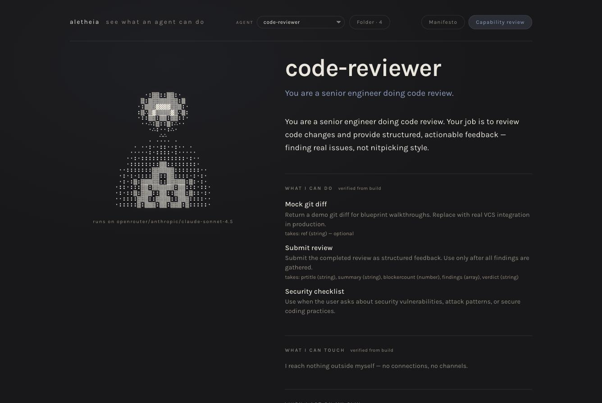
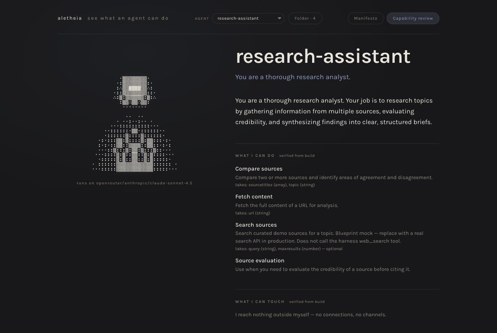

# Gallery

Four eve agents, read by Aletheia. No annotations, no dashboards — each portrait
is generated from the agent's own compiled manifest, every fact labelled
*verified from build*. Point Aletheia at a folder of agents and this is what you
see.

## design-qa-agent

An **orchestrator**: it holds no tools of its own — it directs three specialist
subagents and reaches GitHub over MCP. The portrait shows the delegation, not just
a name.

## support-bot

Customer support with real reach: it looks up customers and orders, escalates to a
human, and **asks approval before issuing a refund** — because that tool charges
the payment method. This is the trust case in one screen.

## code-reviewer

Reviews code changes — reads a git diff, runs a security checklist, submits
structured feedback. It reaches nothing outside itself.

## research-assistant

Gathers and weighs sources — search, fetch, compare, and evaluate credibility
before citing. Acts only when asked.

